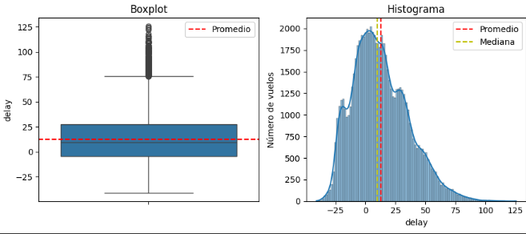
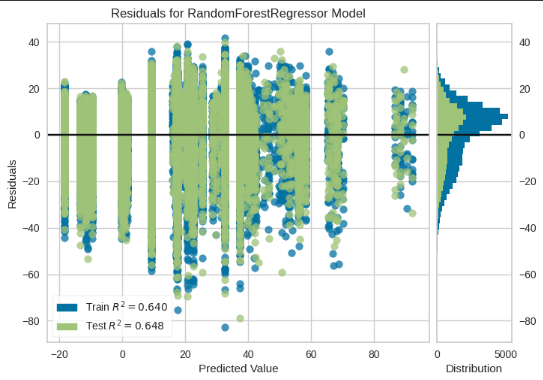
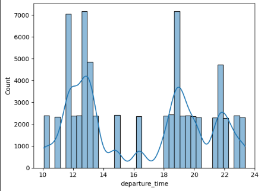

✈️ Optimización Aeroportuaria con Python y Google Colab
📌 Descripción del Proyecto

En este proyecto se realiza un análisis de datos relacionados con vuelos y operaciones aeroportuarias. El objetivo principal es identificar patrones, evaluar el comportamiento de los vuelos y proponer mejoras en la gestión y optimización del tráfico aéreo.

🔍 Datos Analizados

Fuente de datos: archivo flights.csv.

Tipo de datos incluidos:

Información de vuelos (número de vuelo, fecha, aerolínea, origen, destino).

Horarios programados y reales (salida y llegada).

Retrasos y tiempos de espera.

Información de aeropuertos involucrados.

A qué se refieren los datos: representan el registro histórico de vuelos, con indicadores clave de desempeño aeroportuario.

Quiénes están representados: aerolíneas, pasajeros indirectamente (a través de retrasos), y aeropuertos.

🛠️ Tecnologías Utilizadas

Entorno de desarrollo: Google Colab.

Lenguaje de programación: Python 3.

Formatos de datos: CSV, notebooks Jupyter (.ipynb).

📚 Librerías Usadas

Pandas: manipulación y limpieza de datos.

NumPy: cálculos numéricos y operaciones matriciales.

Matplotlib: visualización de gráficos.

Seaborn (opcional): gráficos estadísticos con mejor estética.

Scikit-learn: entrenamiento y evaluación de modelos predictivos.

📊 Visualizaciones Realizadas

A lo largo del análisis se generaron gráficos para ilustrar los hallazgos más relevantes:

📌 Distribución y retrasos de vuelos

Boxplot de retrasos y histograma que muestra la relación entre retraso y número de vuelos.

👉 Este gráfico permite visualizar la dispersión de los retrasos, identificar outliers y observar cómo se distribuyen en relación al volumen de vuelos.

📌 Análisis predictivo con Random Forest

Gráfico de residuos del modelo RandomForestRegressor.

👉 Se utilizó para evaluar la calidad del modelo y observar el comportamiento de los errores de predicción frente a los valores reales.

📌 Comportamiento de salidas por horario

Gráfico de dispersión entre hora de salida y cantidad de vuelos.

👉 Este gráfico evidencia los horarios de mayor congestión aeroportuaria y ayuda a detectar picos de demanda en franjas horarias críticas.

⚠️ Problemas Encontrados y Soluciones

Datos faltantes o inconsistentes: se aplicaron técnicas de limpieza con Pandas (dropna(), fillna()).

Valores atípicos (outliers) en retrasos: se identificaron mediante boxplots y se decidió conservarlos porque aportan información sobre demoras extremas.

Archivos grandes: para optimizar la lectura se usó chunksize en Pandas y filtrado de columnas relevantes.

📈 Resumen del Análisis

Se identificaron aerolíneas con mayor frecuencia de retrasos.

Los aeropuertos con más tráfico presentaron también mayores tiempos de espera.

Los retrasos se concentran en determinadas franjas horarias y meses específicos.

Existe una correlación entre distancia recorrida y probabilidad de retraso.

El modelo predictivo basado en Random Forest permitió estimar los retrasos con un nivel aceptable de precisión.

✅ Conclusión

El análisis realizado permitió encontrar patrones en los retrasos de vuelos, puntos críticos en aeropuertos y tendencias temporales relevantes.
Además, se probó un modelo predictivo de machine learning para estimar retrasos en función de las características de los vuelos.

Estos hallazgos pueden servir como base para mejorar la gestión aeroportuaria, optimizar la programación de vuelos y reducir el impacto de los retrasos en pasajeros y aerolíneas.
